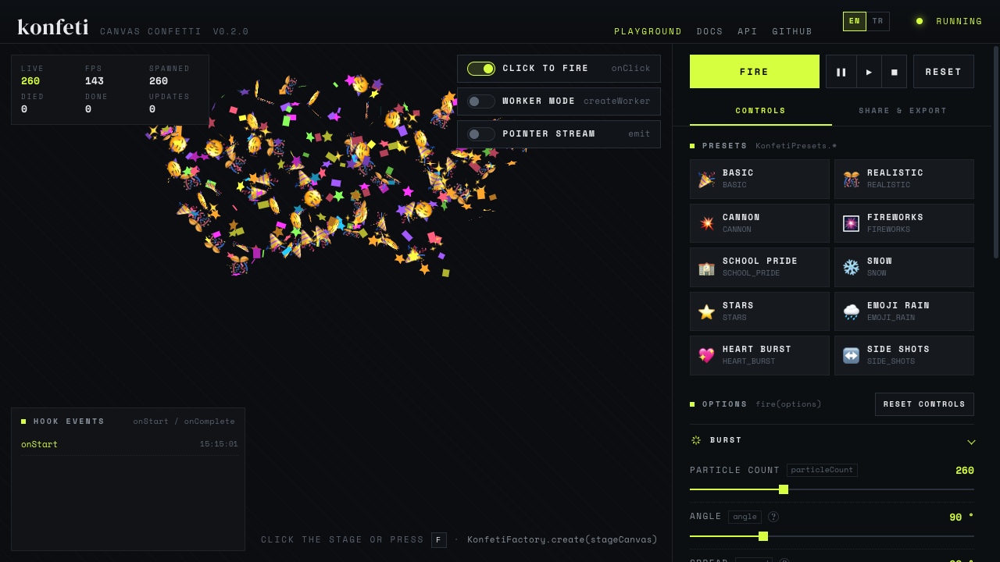

# konfeti

**Canvas confetti that is tiny to start with and goes as far as you need.** One call for a classic pop — and,
when you want more, emoji, text, images and spritesheets, streams that follow the pointer, composable physics,
Web Worker rendering and a fully typed plugin API. Zero dependencies.

[](https://github.com/mbattaloglu/konfeti/actions/workflows/ci.yml)
-~15%20kB%20brotli-d6ff3f>)


[](LICENSE)

**English** · [Türkçe](README.tr.md)

**[Playground](https://konfeti.mbattaloglu.com/)** · **[Guide](https://konfeti.mbattaloglu.com/docs/)** ·
**[API reference](https://konfeti.mbattaloglu.com/docs/api/)**

[](https://konfeti.mbattaloglu.com/)

```ts
import { Konfeti } from "konfeti";

Konfeti.fire(); // that's it: a classic confetti pop on a fullscreen overlay
```

## Contents

- [Why konfeti](#why-konfeti)
- [Install](#install)
- [Quick start](#quick-start)
- [Features](#features)
- [Entry points](#entry-points)
- [Bundle size](#bundle-size)
- [Browser support](#browser-support)
- [Playable ads & webviews](#playable-ads--webviews)
- [Documentation](#documentation)
- [Development](#development)
- [License](#license)

## Why konfeti

- **One call, no setup.** `Konfeti.fire()` creates its overlay canvas on first use, keeps it sized to the
  window at the device pixel ratio, and stops its animation loop when the last particle is gone.
- **Every setting of the paper particle is yours** — forms, colors, gradients, corner radius, flip, wobble,
  shine, fade and scale over life — and every numeric option takes a fixed value or a random range.
- **More than paper.** Stars, hearts, polygons, ribbons, SVG paths, emoji, text, images and animated
  spritesheets, mixed with weights in a single burst.
- **Types are part of the product.** Every option is documented in its type, autocompletes, and is checked:
  a misspelled shape or an out-of-place option fails to compile. Your own shapes and physics join the same types
  through declaration merging.
- **Built for the frame loop.** Pooled particles, no allocations per frame, glyphs rasterized once and cached,
  spritesheets drawn by source rectangle, and the loop stops itself when nothing is left.
- **Small, and only as big as what you use.** ~15 kB brotli for the full `Konfeti.fire()`, ~12 kB with
  `konfeti/lite`, and Web Worker rendering lives in its own entry — bundles that never use it carry none of it.

## Install

```sh
npm install konfeti
# or: pnpm add konfeti · yarn add konfeti
```

> konfeti 0.2.0 is ready and about to be published to npm. Until then, build it from this repository
> (`pnpm install && pnpm build`) or try everything live in the [playground](https://konfeti.mbattaloglu.com/).

Without a bundler, load the `<script>` build (it defines `window.konfeti`):

```html
<script src="https://cdn.jsdelivr.net/npm/konfeti/dist/konfeti.iife.js"></script>
<script>
  konfeti.Konfeti.fire();
</script>
```

## Quick start

```ts
import { Konfeti, KonfetiPresets } from "konfeti";

// fire from a button, upward and a bit wider than the default
button.addEventListener("click", (event) => {
  Konfeti.fire({ origin: event, spread: 90, particleCount: 120 });
});

// a ready-made look
Konfeti.fire(KonfetiPresets.FIREWORKS);

// every burst is awaitable
await Konfeti.fire({ particleCount: 80 });
console.log("the last particle is gone");
```

## Features

### The paper particle

The default confetti piece, fully configurable. Numbers take a value, a `[min, max]` range or `{ min, max }`.

```ts
Konfeti.fire({
  paper: {
    form: ["rect", "circle", { value: "strip", weight: 2 }], // weighted mix of silhouettes
    width: [6, 10],
    height: [12, 18],
    cornerRadius: 2, // or per corner: { tl: 6, br: 6 }
    colors: ["#ff0a54", "#ffd000", { color: "#00c2ff", weight: 3 }],
    gradient: { colors: ["gold", "orange"], angle: 45 },
    flip: { axis: "both", frequency: [0.5, 1.5] }, // the back shows a darker shade
    wobble: { amplitude: [2, 8] },
    shine: 0.5, // glossy highlight as it turns
    fadeOut: { start: 0.6, easing: "easeInQuad" },
  },
});
```

### Shapes: emoji, text, images, spritesheets …

Mix any shapes with weights; each one can override the paper style.

```ts
Konfeti.fire({
  shapes: [
    { type: "paper", weight: 4 },
    { type: "star", points: [5, 6], shine: 0.6 },
    { type: "heart", colors: "#ff4d6d" },
    { type: "emoji", emoji: ["🎉", "🥳", "✨"], size: [22, 32] },
    { type: "text", text: ["YAY", "WOW"], fontWeight: 900 },
    { type: "image", src: "/coin.png", size: [20, 30] },
    { type: "spritesheet", src: "/coin-spin.png", frames: { cols: 8, rows: 1 }, fps: 14 },
  ],
});
```

Built in: `paper`, `star`, `triangle`, `polygon`, `heart`, `ribbon`, `path` (any SVG path), `emoji`, `text`,
`image` and `spritesheet`. Emoji and text are rasterized once and cached — and redrawn automatically if their
web font finishes loading later.

### Presets

Ten ready-made looks, as plain read-only data:

```ts
import { Konfeti, KonfetiPresets, extendPreset } from "konfeti";

Konfeti.fire(KonfetiPresets.SNOW);
Konfeti.fire(extendPreset(KonfetiPresets.FIREWORKS, { particleCount: 80 })); // your settings win
```

`BASIC`, `REALISTIC`, `CANNON`, `SIDE_SHOTS`, `SCHOOL_PRIDE`, `FIREWORKS`, `SNOW`, `STARS`, `EMOJI_RAIN`,
`HEART_BURST`.

### Continuous emitter

Stream particles until you stop — a fountain, a trail behind the pointer, sparks from an element.

```ts
const trail = Konfeti.emit({
  rate: 60, // particles per second
  follow: "pointer", // or an element, or a point like { x: 0.5, y: 1 }
  spread: 360,
  startVelocity: [50, 150],
  shapes: [{ type: "star", size: [6, 10] }],
});

trail.moveTo(document.querySelector("#rocket")!); // follow something else
trail.stop(); // stop emitting; particles already out finish their lives
await trail;
```

### Physics and emission

```ts
Konfeti.fire({
  physics: {
    gravity: 700, // px/s² — negative floats upward
    drag: 3.5,
    wind: [-40, 40],
    swirl: { strength: [80, 200], frequency: [0.3, 0.8] },
    floor: { y: 1, bounce: 0.35, friction: 0.4 }, // particles bounce and settle
  },
  emission: { mode: "interval", every: 350, times: 8 }, // or "burst" (default) / "stream"
  seed: 42, // same seed, same burst
});
```

### Control

```ts
const burst = Konfeti.fire(); // every fire() returns a handle
burst.pause();
burst.resume();
burst.stop();
await burst;

Konfeti.pause(); // freeze everything (hidden tabs pause on their own)
Konfeti.resume();
Konfeti.reset(); // remove every particle

// fire from the click position on every click; "pointerdown" also works when touch events are cancelled
const off = Konfeti.onClick(button, { particleCount: 30 }, { trigger: "pointerdown" });
off();
```

Hooks — `onStart`, `onParticleSpawn`, `onParticleUpdate`, `onParticleDeath`, `onComplete` — let you watch or
steer every particle.

### Your own canvas

`Konfeti` is a shared fullscreen instance. Create dedicated ones for your own canvas, defaults or particle
budget:

```ts
import { KonfetiFactory } from "konfeti";

const stage = KonfetiFactory.create(document.querySelector("canvas"), {
  maxParticles: 800, // oldest particles make room beyond this (default 1500)
  disableForReducedMotion: true, // honour prefers-reduced-motion (off by default)
  defaults: { paper: { colors: ["gold", "white"] } },
});

stage.fire();
stage.destroy(); // stops, clears and removes its listeners
```

### Web Worker rendering

Move simulation and drawing off the main thread, so big bursts stay smooth while the page is busy:

```ts
import { createWorker } from "konfeti/worker";

const stage = createWorker(document.querySelector("canvas"), { maxParticles: 3000 });
await stage.fire({ particleCount: 1500 });
stage.isWorker(); // false where OffscreenCanvas is missing — it then runs on the main thread
```

Options are type-checked to be worker-safe, element and click origins are measured for you, and
`stage.getStats()` replaces hooks (which cannot run in a worker). The worker script loads on first use.

### Custom shapes and physics

```ts
import { Konfeti, defineShape, definePhysics } from "konfeti";

declare module "konfeti" {
  interface ShapeRegistry {
    diamond: { sharpness?: number };
  }
  interface PhysicsRegistry {
    magnet: { x: number; y: number; strength: number };
  }
}

defineShape("diamond", {
  viewBox: [24, 24],
  path: ({ sharpness = 0.5 }) => `M12 0L${24 - sharpness * 12} 12L12 24L${sharpness * 12} 12Z`,
});

definePhysics("magnet", {
  defaults: { x: 0.5, y: 0.5, strength: 600 },
  apply: (p, dt, world, { x, y, strength }) => {
    p.vx += (x * world.width - p.x) * strength * dt * 0.001;
    p.vy += (y * world.height - p.y) * strength * dt * 0.001;
  },
});

Konfeti.fire({
  shapes: [{ type: "diamond", sharpness: 0.8 }],
  physics: { magnet: { strength: 900 } },
});
```

Both are fully typed everywhere once declared — including autocomplete for `type: "diamond"`.

## Entry points

| Import                              | What you get                                                             |
| ----------------------------------- | ------------------------------------------------------------------------ |
| `konfeti`                           | Everything: all shapes registered, presets, the console banner           |
| `konfeti/lite`                      | Paper only — register just the shapes you use with `registerShapes(...)` |
| `konfeti/worker`                    | `createWorker()` and the worker types                                    |
| `konfeti/konfeti.worker.js`         | The worker script, to self-host under a strict Content-Security-Policy   |
| `dist/konfeti.iife.js` (`<script>`) | `window.konfeti` with everything, including `createWorker`               |

ESM and CommonJS builds with `.d.ts` for every entry; `sideEffects` is set so unused code tree-shakes away.

## Bundle size

Measured with [size-limit](https://github.com/ai/size-limit) (minified + brotli) and checked in CI:

| Usage                                | Size     |
| ------------------------------------ | -------- |
| `Konfeti` from `konfeti`             | ~15.0 kB |
| everything from `konfeti`            | ~16.4 kB |
| `Konfeti` from `konfeti/lite`        | ~11.8 kB |
| `createWorker` from `konfeti/worker` | ~16.8 kB |
| worker script (loaded on first use)  | ~14.2 kB |

## Browser support

Evergreen browsers. The build targets ES2022 (roughly Chrome 85+, Firefox 79+, Safari / iOS 14.5+); let your
bundler lower it if you support older webviews. Worker rendering is feature-detected and falls back to the main
thread where `OffscreenCanvas` is missing. It also works with server-side rendering: importing never touches
the DOM.

## Playable ads & webviews

konfeti fits single-file playable ads: no dependencies, no network requests of its own, no storage, no `eval`.
Pass images as `data:` URIs or elements your engine already loaded, fire on `pointerdown` if your engine cancels
touch events, pause with `Konfeti.pause()` on MRAID `viewableChange`, and call `disableBanner()` in production.
The [guide](https://konfeti.mbattaloglu.com/docs/#playable-ads--webviews) has the full checklist.

## Documentation

- **[Guide](https://konfeti.mbattaloglu.com/docs/)** — every feature with runnable examples
  ([source](packages/konfeti/README.md), [Türkçe](packages/konfeti/README.tr.md))
- **[API reference](https://konfeti.mbattaloglu.com/docs/api/)** — every option, its unit, range and default
- **[Playground](https://konfeti.mbattaloglu.com/)** — tune every option live, then share a link or copy the
  `Konfeti.fire()` code
- **[Changelog](packages/konfeti/CHANGELOG.md)**

## Development

pnpm monorepo:

| Path               | What                                                                   |
| ------------------ | ---------------------------------------------------------------------- |
| `packages/konfeti` | The library (published to npm as `konfeti`)                            |
| `playground/`      | Site: playground (`/`), guide (`/docs/`), API reference (`/docs/api/`) |
| `e2e/`             | Playwright browser tests against the built library and site            |
| `docs/PLAN.md`     | Roadmap and design notes                                               |

```sh
pnpm install
pnpm dev          # site on http://localhost:5199 (generates the API reference first)
pnpm test         # unit + type tests (Vitest)
pnpm e2e          # build, then browser tests in the installed Chrome (Playwright)
pnpm typecheck    # tsc --noEmit in every package
pnpm lint         # ESLint (strict type-checked)
pnpm build        # library → ESM + CJS + IIFE + .d.ts
pnpm size         # size budgets
pnpm site:build   # static site → playground/dist
```

Issues and pull requests are welcome. CI runs formatting, lint, types, unit tests, the build, size budgets and
the browser tests on every push.

## License

[MIT](LICENSE) © mbattaloglu
